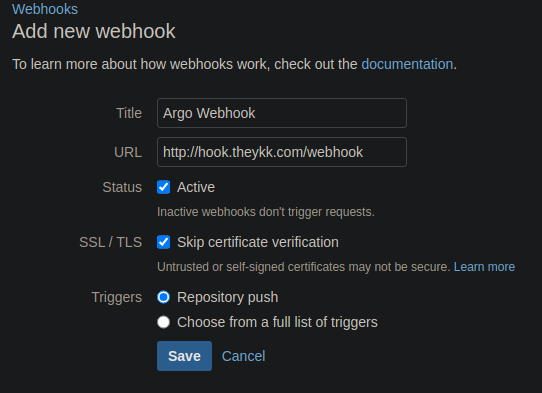
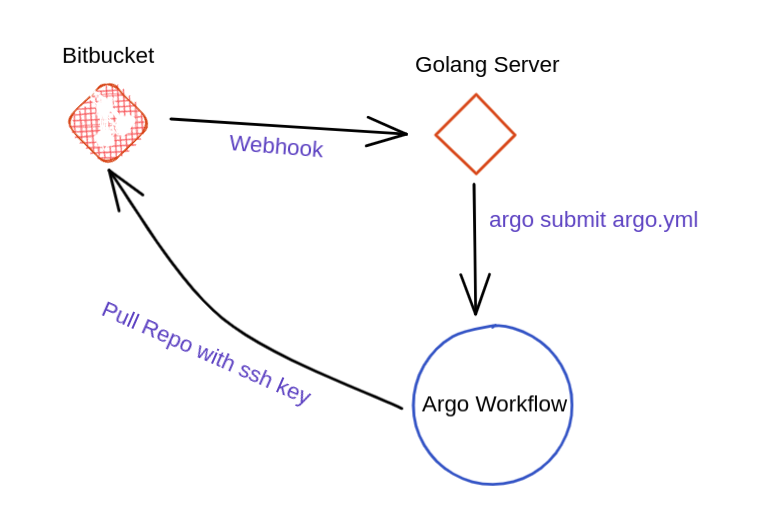

# Bitbucket argo-workflow-webhook
Continuous integration with Argo that supports bitbucket private webhooks.
To use this webhook project, your argo workflow file name should `argo.yml` at root directory.

## Installation
If you want to enable tls on ingress edit `ingress-tls.yml` file and change `<host>` and `<secret-name>` and run `kubectl apply -f kubernetes/ingress-tls.yml` and skip to run `kubectl apply -f kubernetes/ingress.yml`


Change `<host>` in the `ingress.yml` file. This file resides in the `kubernetes` folder.
Change `WH_REPO` env value `TheYkk` in `deployment.yml`, change it with your organization name or user name. The config is case insensitive.

```
kubectl apply -f kubernetes/deployment.yml
kubectl apply -f kubernetes/ingress.yml
kubectl apply -f kubernetes/service.yml
```

After that generate ssh-key with [ssh-keygen](https://support.atlassian.com/bitbucket-cloud/docs/set-up-an-ssh-key/) and add public key to repo.

With generated ssh-key we need to store our secret key in kubernetes, to do that run `./create-secret.sh` example ->

```
./create-secret.sh test-key.pem
```

## Usage
Once deployed, add a webhook to your bitbucket repositories `https://<your-argo-domain>/webhook`.

### ingress
Change the url in the ingress before deploying. This Ingress will route traffic from your Argo domain to the Argo CI implementation, Bitbucket will use this domain as a webhook.

### starter workflow 
The webhook is going to be called and it will start up a 'starter' Workflow, which in turn will pull the repository and start the ```argo.yml``` Workflow which has to reside in the root of the repository. The argo.yml file in this repository consists of a ```sshPrivateKeySecret``` named 'bitbucket-creds', this has to be a secret in the namespace you will deploy this in. Feel free to rename this and adjust this in the argo.yml file. This Secret is needed to be able to pull your repository from Bitbucket and start the actual Workflow.

## Flow

## Thanks to

@BouweCeunen https://github.com/BouweCeunen/argo-continuous-integration